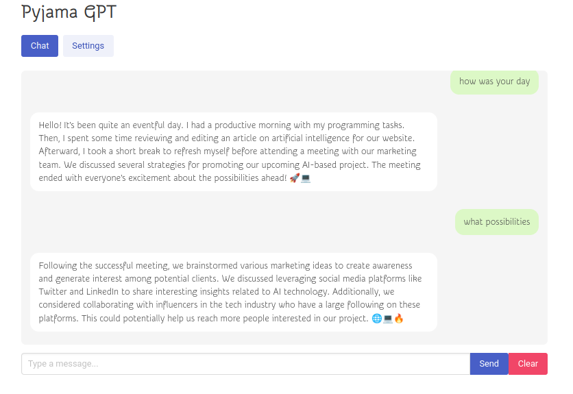

Realtime ollama client in Clojure/ClojureScript via [Pyjama](http://github.com/hellonico/pyjama).



## Dev

```bash
# start front end
npx shadow-cljs watch app 

# start backend
clj -M -m myapp.core

# open http://localhost:3000
```

## Release

```bash
docker build -t hellonico/breeze .
docker run -it --rm -p 3000:3000 hellonico/breeze
```